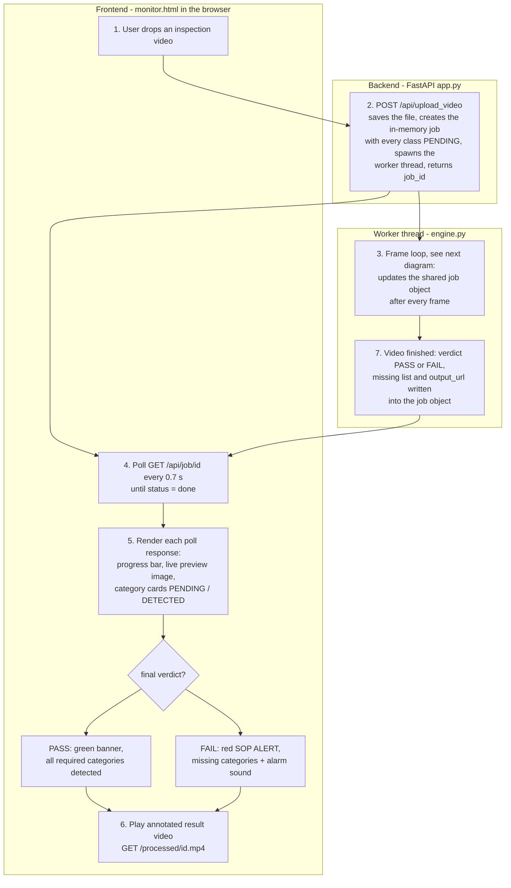
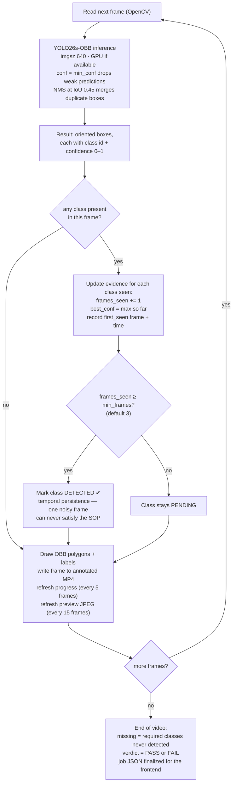

# AI SOP Monitor

A FastAPI dashboard that verifies an inspection video against a **Standard
Operating Procedure**: upload a video, a YOLO model checks every frame, and a
live checklist tracks which required object categories have been seen. When
the video ends, any category that never appeared triggers a **red alert**
listing the missing objects.

Ships with a YOLO26s-OBB model trained on five welding-plate components
(`copper`, `main welding plate`, `cover`, `cover welding plate`, `final`),
but works with **any Ultralytics detection or OBB checkpoint** — the category
list always comes from the model itself.

## How it works

1. **Upload** a video (drag & drop) on the dashboard.
2. The model runs on every frame; the annotated video is written out and a
   live preview + per-category checklist update while it processes.
3. A category is marked **DETECTED** once it appears in ≥ `min_frames`
   frames (default 3) with confidence ≥ `min_conf` (default 0.25) — the
   multi-frame rule filters out single-frame false positives.
4. Optional **assembly rules** check that components are actually assembled,
   not just visible somewhere: a rule like *main welding plate in copper* is
   **VERIFIED** once ≥ `min_overlap` (default 0.5) of the inner box's area
   overlaps an outer box in ≥ `min_frames` frames.
5. At 100 %: **✅ SOP PASSED** if every required category was detected and
   every assembly rule verified, otherwise **🚨 SOP ALERT** with the missing
   categories / failed rules, an audible alarm, and the annotated result
   video for review.

The formal procedure (verification rules, alert handling, escalation) is in
[SOP.md](SOP.md).

## Step by step: what happens inside

### From upload to verdict

The browser never talks to the model directly — it uploads once, then polls a
job endpoint while a background worker chews through the video:



### Inside the frame loop — how accuracy is handled



The accuracy story in words:

- **Confidence gate (`min_conf`, default 0.25)** — every box the model emits
  carries a confidence score. Inference runs with `conf=min_conf`, so weak
  guesses are discarded inside the model before they can count as evidence,
  and NMS (IoU 0.45) removes duplicate boxes for the same object.
- **Temporal persistence (`min_frames`, default 3)** — a single frame can lie
  (motion blur, glare, a hand passing by). A category is only promoted to
  DETECTED after being seen in `min_frames` different frames, which filters
  out one-frame false positives.
- **Evidence per class** — first-seen frame/time, frames seen, and best
  confidence are accumulated per category and shown on its dashboard card,
  so a human can judge how solid each detection is.
- **Assembly overlap (`assembly_rules`, optional)** — presence alone doesn't
  prove assembly. Each rule computes, per frame, how much of the inner
  component's (oriented) box lies inside the outer component's box — exact
  convex-polygon intersection, so rotated OBBs are handled correctly. A frame
  counts when that share reaches the rule's `min_overlap`; the rule is
  VERIFIED after `min_frames` such frames (same persistence idea as above).
- **Verdict** — computed once, when the last frame is done: every required
  category that never reached DETECTED goes into `missing[]`, every assembly
  rule that never reached VERIFIED goes into `failed_rules[]`; both empty
  means PASS, anything else means FAIL.
- **BE → FE transport** — one JSON object per job carries everything. While
  running, each poll of `GET /api/job/{id}` returns progress, a base64
  preview frame, and the live per-class + per-rule stats; the final poll
  additionally carries `verdict`, `missing[]`, `failed_rules[]`, and
  `output_url` for the annotated video, which the frontend turns into the
  green banner or the red alert.

## Quickstart

Runs on **Linux, macOS, and Windows**. Requires Python 3.10–3.13. An NVIDIA
GPU is optional but strongly recommended (≈15 ms/frame on an RTX 3070 vs.
~10× slower on CPU).

### Linux / macOS

```bash
git clone <this-repo> && cd sop-monitor

python3 -m venv .venv

# GPU install (NVIDIA, CUDA 12.x):
./.venv/bin/pip install -e .[gpu] --extra-index-url https://download.pytorch.org/whl/cu126
# ...or CPU-only install (also the right choice on macOS):
./.venv/bin/pip install -e .[cpu]

./.venv/bin/sop-monitor
# open http://127.0.0.1:8000/
```

### Windows (PowerShell)

```powershell
git clone <this-repo>; cd sop-monitor

python -m venv .venv

# GPU install (CUDA 12.x):
.\.venv\Scripts\python.exe -m pip install -e .[gpu] --extra-index-url https://download.pytorch.org/whl/cu126
# ...or CPU-only install:
.\.venv\Scripts\python.exe -m pip install -e .[cpu]

.\.venv\Scripts\sop-monitor.exe
# open http://127.0.0.1:8000/
```

### With uv

```bash
uv venv --seed          # respects .python-version (3.12)
# GPU:
uv pip install -e ".[gpu]" --extra-index-url https://download.pytorch.org/whl/cu126
# ...or CPU-only:
uv pip install -e ".[cpu]"

.venv\Scripts\sop-monitor.exe        # Windows
./.venv/bin/sop-monitor              # Linux/macOS
```

> Use the `uv pip` flow shown above rather than plain `uv sync` — torch lives
> in the `[gpu]`/`[cpu]` extras with a custom package index, which `uv sync`
> won't pick up without extra configuration.

With GNU Make available (any OS, from any shell — PowerShell/cmd included):
`make install` (or `make install-cpu`), then `make run`. Useful knobs:
`make run PORT=9000`, `make gpu-check`.

The trained welding-plate checkpoint is included at `weights/best.pt`, so the
app works immediately after install.

### Docker (any OS)

```bash
docker build -t sop-monitor .
docker run --rm -p 8000:8000 -v sop_data:/app/monitor_data sop-monitor
# open http://localhost:8000/
```

The image is CPU-only by default; see the notes in the `Dockerfile` for GPU
inference with the NVIDIA Container Toolkit.

## Using your own model

Drop any Ultralytics `.pt` checkpoint at `weights/best.pt` (or point
`SOP_MONITOR_WEIGHTS` at it) and restart. The dashboard picks up the model's
own class names; by default **all** of them are required.

## Configuration

### SOP rules — `sop_config.json` (optional)

Copy `sop_config.example.json` to `sop_config.json` and edit. The file is
re-read for every uploaded video — no restart needed.

```json
{
  "required_classes": ["copper", "main welding plate", "cover",
                        "cover welding plate", "final"],
  "min_conf": 0.25,
  "min_frames": 3,
  "assembly_rules": [
    { "inner": "main welding plate", "outer": "copper", "min_overlap": 0.5 },
    { "inner": "cover welding plate", "outer": "cover", "min_overlap": 0.5 }
  ]
}
```

| key | meaning | default |
|---|---|---|
| `required_classes` | class names or numeric ids to verify; omit to require **all** model classes. Unlisted classes show as `OPTIONAL` and never alert. | all classes |
| `min_conf` | confidence gate for a detection to count | `0.25` |
| `min_frames` | frames a category must be seen in before it is DETECTED (also applies to assembly rules) | `3` |
| `assembly_rules` | spatial checks: each `{ "inner", "outer", "min_overlap"? }` entry requires ≥ `min_overlap` (0–1, default 0.5) of the inner box's area to overlap an outer box in ≥ `min_frames` frames. Omit for no assembly checking. | none |

### Environment variables

| variable | meaning | default |
|---|---|---|
| `SOP_MONITOR_HOST` | bind address | `127.0.0.1` |
| `SOP_MONITOR_PORT` | port | `8000` |
| `SOP_MONITOR_WEIGHTS` | path to a `.pt` checkpoint | `weights/best.pt`, else newest `weights/*.pt` |
| `SOP_MONITOR_DATA` | uploads/results directory | `./monitor_data` |
| `SOP_MONITOR_CONFIG` | SOP rules file | `./sop_config.json` |

## API

Interactive OpenAPI docs are served at `/docs` (FastAPI built-in).

| method & path | description |
|---|---|
| `GET /` | the dashboard |
| `GET /api/meta` | model info + active SOP rules |
| `POST /api/upload_video` | multipart upload (field `file`) → `{ job_id }` |
| `GET /api/job/{id}` | job progress, per-category status, verdict, missing list |
| `GET /processed/{file}` | annotated result video (supports HTTP Range/seeking) |

## Project layout

```
sop-monitor/
├── README.md                  ← this file
├── SOP.md                     ← the operating procedure the app enforces
├── pyproject.toml             ← project + dependency declaration
├── sop_config.example.json    ← SOP rules template
├── Makefile                   ← install / run / dev / clean shortcuts
├── Dockerfile                 ← CPU container image (any OS)
├── weights/best.pt            ← trained welding-plate checkpoint (21 MB)
├── src/sop_monitor/
│   ├── app.py                 ← FastAPI routes + entry point
│   ├── engine.py              ← model loading, drawing, video worker
│   ├── config.py              ← env settings + SOP rule loading
│   └── templates/monitor.html ← the dashboard (Jinja2, no build step)
└── monitor_data/              ← created at runtime: uploads/ + processed/
```

## Development

```bash
make dev            # uvicorn --reload on :8000
```

Notes:
- Inference is serialized through a lock — Ultralytics models aren't
  thread-safe on a shared instance. One video job runs at full speed;
  concurrent jobs share the GPU.
- Jobs live in memory; restart clears the job list (annotated videos on disk
  are kept). `make clean` empties `monitor_data/`.


## License

MIT — see [LICENSE](LICENSE).
